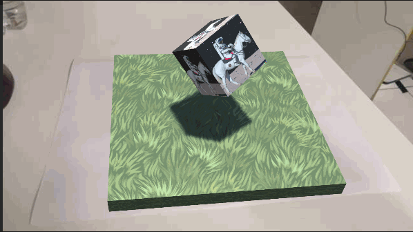

# Realidade Aumentada com Unity
Projeto realizado em aula, referente a matéria de computação gráfica e tecnologias imersivas, na qual foi utilizado o Unity e o Vuforia que poossibilitam a criação de projetos utilizando AR.

## Projeto
No projeto realizado foi feita a criação de um cubo utilizando AR em que foi colocado rotacionamento no objeto, movimento entre os eixos controlados pelo teclado e aplicação de fisica ao objeto.

#### Primeiramente deve ser baixado e instalado o Vuforia, você pode utilizar o link a seguir

[Download](https://developer.vuforia.com/user/login?url=/downloads/sdk%3F_%3D1678117884)

Após fazer o download deve ser realizado a criação de uma conta no site do [Vuforia](https://developer.vuforia.com/vui/auth/login) e registrar sua licença ao Unity. Ainda no site do Vuforia deve ser realizado a criação de um banco de dados e depois realizar o download do banco de dados no Unity.


<!--alvo-->
<p>Para o projeto foi utilizado o seguinte alvo:</p>
	
</p>


## Montar Cena
No cenario, acima do Alvo foi inserido um campo plano para ser o chão, e logo sobre ele o cubo 

<!--cena-->
<p>
	
</p>

## 1 - Rotacionar Cubo
Foi realizado a criação de um script para realizar o movimento e carregado no cubo.

```javascript
using System.Collections;
using System.Collections.Generic;
using UnityEngine;

public class rotate : MonoBehaviour
{
    public Vector3 rotateAmount;

    void Start()
    {
        
    }

    // Update is called once per frame
    void Update()
    {
       transform.Rotate(rotateAmount * Time.deltaTime);
    }
}
```
Nas configurações do cubo foi inserido os eixos de rotação(X: 46; Y: 46; Z: 46).

<!--rotate-->
<p>
	
</p>

## Resultado

<!--rotatefinal-->
<p>
  
</p>

## 2 - Mover Cubo com teclado
Foi criado um script colocando as setas do teclado para moverem o cubo na direção desejada e carregado nele.

```javascript
using System.Collections;
using System.Collections.Generic;
using UnityEngine;

public class movimento : MonoBehaviour
{
    // Start is called before the first frame update
    void Start()
    {
        
    }

    // Update is called once per frame
    void Update()
    {
        if (Input.GetKey(KeyCode.LeftArrow))
        {
            transform.Translate(0.01f, 0f, 0f);
        }
        if (Input.GetKey(KeyCode.RightArrow))
        {
            transform.Translate(-0.01f, 0f, 0f);
        }
        if (Input.GetKey(KeyCode.DownArrow))
        {
            transform.Translate(0f, 0f, 0.01f);
        }
        if (Input.GetKey(KeyCode.UpArrow))
        {
            transform.Translate(0f, 0f, -0.01f);
        }
    }
}
```
## Resultado

<!--movimentofinal-->
<p>
  
</p>

## 3 - Aplicando Gravidade

Deve-se adicionar o componente physics -> rigidbody, e
em seguida é selecionado os cubos e marcado a opção de "Use Gravity". 

## Resultado

<!--gravidadefinal-->
<p>
  
</p>